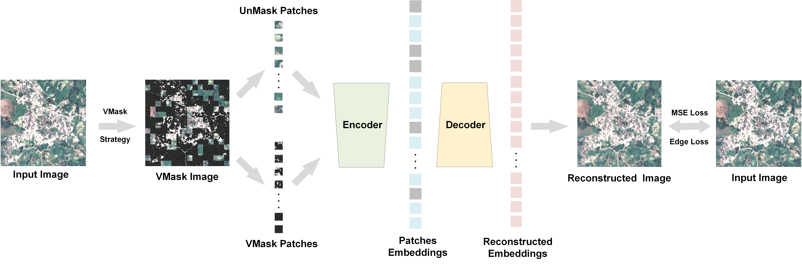
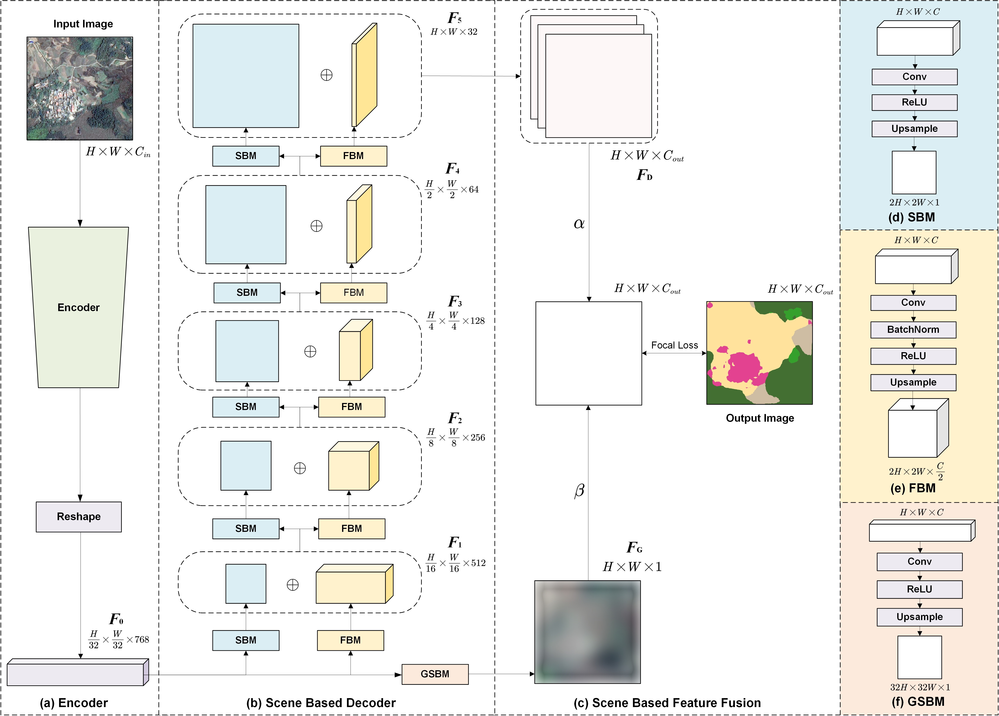

# Investigating Very High Resolution Land Cover Mapping in the Pearl River Delta with Remote Sensing Foundation Model and Multi-Source Data Bayesian Fusion

***
## Introduction

<!-- <b> Official implementation of [SDMAE-SBFNet](https://ieeexplore.ieee.org/document/10975807) by [Junshen Luo](https://github.com/JeasunLok), Jiahe Li, Xinlin Chu, Sai Yang, Lingjun Tao and Qian Shi. </b> -->
<b> Official implementation of SDMAE and SBFNet for VHR land cover mapping by [Junshen Luo](https://github.com/JeasunLok), Yikai Zhao, Mingyang Xuan, Jizhou Zhen, Yan Zhou* and Xiaoping Liu. </b>
***
<div align="center">
    
</div>

***

<div align="center">
    
</div>

***

## How to use it?
### 1. Installation
```
git clone https://github.com/JeasunLok/SDMAE-SBFNet.git && cd SDMAE-SBFNet
conda create -n SDMAE-SBFNet python=3.11
conda activate SDMAE-SBFNet
pip install -r requirements.txt
```

### 2. Download our datasets

Download our datasets from Zenodo:

Zenodo: https://doi.org/10.5281/zenodo.18301135.

Then run `generate_list_pretrained.py` or `generate_list_segmentation.py` to generate the data lists and place the them in the correct path of `data` folder. You can also adjust the path in the source code to sucessfully load the data.

### 3. Quick start to use our pretraining model SDMAE

<b> You should change the settings in `sdmae_pretrain_ddp.py` then: </b>
```
torchrun --nproc_per_node=2 sdmae_pretrain_ddp.py
```
You can use tensorboard to visualize the pretraining process:
```
tensorboard --logdir=/path/log_folder/SummaryWriter --port=6061
```
Then link it to your PC through ssh:
```
ssh -NfL (port of your PC):127.0.0.1:6061 username@host -p port
```

### 4. Quick start to use our semantic segmentation model SBFNet with SDMAE
<b> Once you successfully pretrained SDMAE</b>, you can use the encoder of pretrained model by changing the `encoder_path` in `train_SDSBFNet.py` to train SBFNet:
```
torchrun --nproc_per_node=2 train_SDSBFNet.py
```

### 5. More information
For pretraining:
```
torchrun --nproc_per_node=2 mae_pretrain_ddp.py --help
```
For fine-tuning, you can change the parameters in `train_SDSBFNet.py` then:
```
torchrun --nproc_per_node=2 train_SDSBFNet.py
```
For other comparative models, see `compared_models.py` then:
```
torchrun --nproc_per_node=2 train_compared_models.py
```
For ablation study of SDMAE, see `models.py` then:
```
torchrun --nproc_per_node=2 mae_pretrain_ddp.py # pretrain MAE
torchrun --nproc_per_node=2 train_SBFNet.py # fine-tune MAE-SBFNet 
torchrun --nproc_per_node=2 sdmae_pretrain_ddp_ablation_noe.py # pretrain MAE with VMask Strategy
torchrun --nproc_per_node=2 train_SDSBFNet_noe.py # fine-tune MAE with VMask Strategy
torchrun --nproc_per_node=2 sdmae_pretrain_ddp_ablation_nov.py # pretrain MAE with Edge Enhanced Loss
torchrun --nproc_per_node=2 train_SDSBFNet_nov.py # fine-tune MAE with Edge Enhanced Loss
```
For ablation study of SBFNet, see `models.py` then:
```
torchrun --nproc_per_node=2 train_SDSBFNet_ablation_no.py # only FBM
torchrun --nproc_per_node=2 train_SDSBFNet_ablation_noGSBM.py # FBM + SBM
torchrun --nproc_per_node=2 train_SDSBFNet_ablation_noFBM.py # FBM + GSBM
torchrun --nproc_per_node=2 train_SDSBFNet.py # SBFNet: FBM + SBM + GSBM
```

<!-- ***
## Citation
<b> Please kindly cite the papers if this code is useful and helpful for your research. </b>

J. Luo, J. Li, X. Chu, S. Yang, L. Tao and Q. Shi, "BTCDNet: Bayesian Tile Attention Network for Hyperspectral Image Change Detection," in IEEE Geoscience and Remote Sensing Letters, vol. 22, pp. 1-5, 2025, Art no. 5504205, doi: 10.1109/LGRS.2025.3563897.

```
@article{luo2025btcdnet,
  title={BTCDNet: Bayesian Tile Attention Network for Hyperspectral Image Change Detection},
  author={Luo, Junshen and Li, Jiahe and Chu, Xinlin and Yang, Sai and Tao, Lingjun and Shi, Qian},
  journal={IEEE Geoscience and Remote Sensing Letters},
  year={2025},
  publisher={IEEE}
}
``` -->

***
## Contact Information
Junshen Luo: luojsh7@mail2.sysu.edu.cn

Junshen Luo is with School of Geography and Planning, Sun Yat-sen University, Guangzhou 510275, China
***